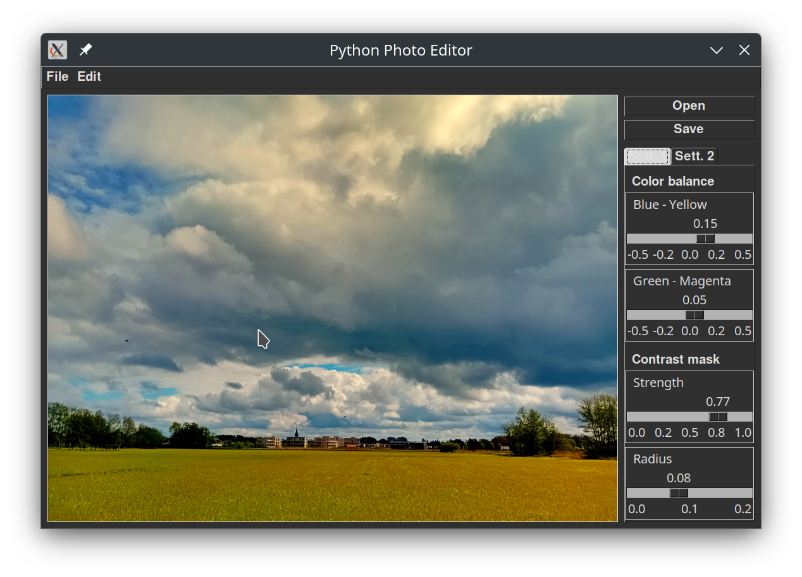

# python-foto-editor
a simple photo editor using Python, Pillow, Numpy and Tkinter

It allows to open an image and adjust
* Color temperature with Blue-Yellow and Green-Magenta settings 
* Contract mask with Strenght and Blur-radius settings
* brightness, contrast and saturation
